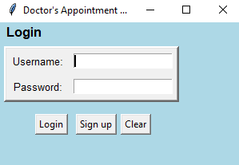

# doctor-appointment-booking-application
### 1. Prepare database
 
#### 1.1 Download Oracle 18c Express Edition for Windows: https://www.oracle.com/database/technologies/xe-downloads.html

If DB is installed on a different VM/Server/PC (not the one "hosting" Python code) - modify function **dsn = cx_Oracle.makedsn()**
 ```
dsn = cx_Oracle.makedsn(
    '<INSERT_REMOTE_IP_FQDN_HERE>',
    '1521',
    service_name='XE'
 ```
#### 1.2 Download SQLdeveloper: https://www.oracle.com/ca-en/tools/downloads/sqldev-v192-downloads.html

#### 1.3 Create a connection from SQLdeveloper to Oracle database:

   1.3.1 Click on the green plus sign:

   

   1.3.2 Type **system** in the username field and **system** in the password field. If DB is located on remote system - insert IP or FQDN of your DB server into field **Hostname**:

   

   1.3.3 Click the **Test** button. You would get status as success.  
   1.3.4 Click on **Save** and the new connection would appear on left.  
   1.3.5 Now double click on that connection and run script below.

#### 1.4 Create table **patient**:
 
 ```
CREATE TABLE patient (username VARCHAR(20), password VARCHAR(20), first_name VARCHAR(20), last_name VARCHAR(20), gender VARCHAR(1), 
city VARCHAR(20), address VARCHAR(40), PRIMARY KEY(username));

INSERT INTO patient VALUES ('K', '123456', 'Kate', 'Senn', 'F', 'Montreal', '1730 St. Catherine');
INSERT INTO patient VALUES ('N', '123ABC', 'Nick', 'Foster', 'M', 'Laval', '1009 Peel St.');
INSERT INTO patient VALUES ('T', '123dez', 'Tom', 'Smith', 'M', 'Brossard', '1254 Rom St.');
INSERT INTO patient VALUES ('M', '123dez', 'Mary', 'Browen', 'F', 'Dorval', '4369 4e Ave.');

commit;
 ```

#### 1.5 Create table **appointment**:

 ```
CREATE TABLE appointment (appointment_date DATE, username VARCHAR(20), doctor_name VARCHAR(20), PRIMARY KEY(appointment_date), FOREIGN KEY(username) REFERENCES patient);

INSERT INTO appointment (appointment_date, doctor_name) VALUES (TO_DATE('15-NOV-2020 10:00', 'DD-MON-YYYY HH24:MI'), 'Andy');
INSERT INTO appointment (appointment_date, doctor_name) VALUES (TO_DATE('15-NOV-2020 10:30', 'DD-MON-YYYY HH24:MI'), 'Charlie');
INSERT INTO appointment (appointment_date, doctor_name) VALUES (TO_DATE('15-NOV-2020 11:00', 'DD-MON-YYYY HH24:MI'), 'Charlie');
INSERT INTO appointment (appointment_date, doctor_name) VALUES (TO_DATE('15-NOV-2020 11:30', 'DD-MON-YYYY HH24:MI'), 'Andy');
INSERT INTO appointment (appointment_date, doctor_name) VALUES (TO_DATE('15-NOV-2020 12:00', 'DD-MON-YYYY HH24:MI'), 'Andy');
INSERT INTO appointment (appointment_date, doctor_name) VALUES (TO_DATE('16-NOV-2020 10:00', 'DD-MON-YYYY HH24:MI'), 'Andy');
INSERT INTO appointment (appointment_date, doctor_name) VALUES (TO_DATE('16-NOV-2020 10:30', 'DD-MON-YYYY HH24:MI'), 'Charlie');
INSERT INTO appointment (appointment_date, doctor_name) VALUES (TO_DATE('16-NOV-2020 11:00', 'DD-MON-YYYY HH24:MI'), 'Charlie');
INSERT INTO appointment (appointment_date, doctor_name) VALUES (TO_DATE('16-NOV-2020 11:30', 'DD-MON-YYYY HH24:MI'), 'Andy');
INSERT INTO appointment (appointment_date, doctor_name) VALUES (TO_DATE('16-NOV-2020 12:00', 'DD-MON-YYYY HH24:MI'), 'Andy');

commit;

 ```
#### 2. List of implemented features

- patient table;
- appointment table;
- registration form with validation: username is unique and user should specify the values for all the fields:


- log in form:


    
- after successful validation of username and password, display the appointment form and available schedule:

   
    
   
   
 - validations:
    - check if username and/or password are empty; 
    - check if username entered during registration already exists in DB;
    - check if username and password entered by the user during the login step match information in DB;
    - check if the password entered by the use equals the password stored in DB.
    
#### 4. List of future features

 - improve calendar integration


 
 
    
